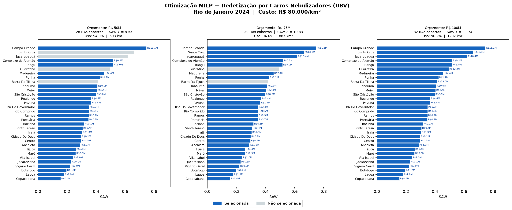
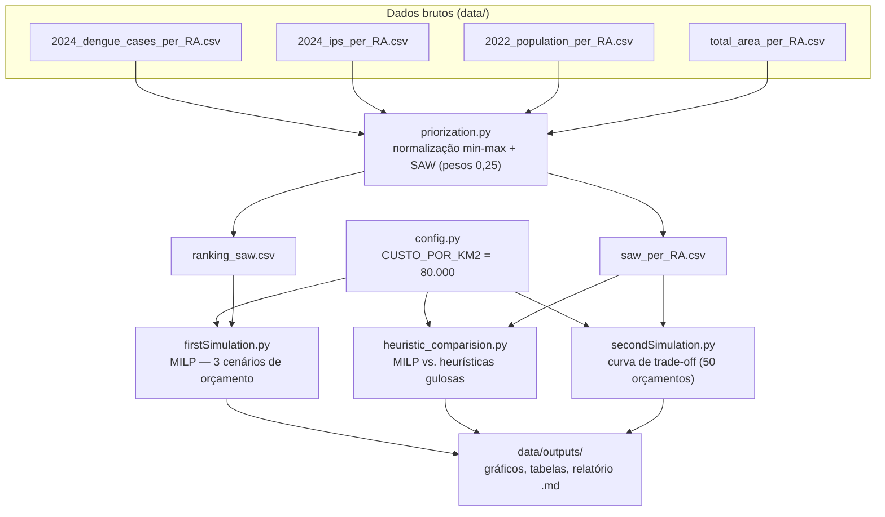

# Priorização de Regiões para Controle de Dengue no Rio de Janeiro

Modelo de otimização (MILP) que decide **quais Regiões Administrativas do Rio nebulizar contra a dengue** dado um orçamento fixo, maximizando um índice de prioridade multicritério.

<!-- TODO: adicionar screenshot/gif aqui.
     Substituir a imagem abaixo por uma captura mais didática — por exemplo
     um GIF curto rodando `python firstSimulation.py` no terminal e abrindo
     os gráficos resultantes, ou um painel montando lado a lado
     milp_cobertura_por_orcamento.png e tradeoff_curve_50.png.
     A imagem atual é uma das saídas reais já geradas pelo projeto. -->



---

## Sobre o projeto

Campanhas de nebulização UBV (ultra baixo volume) contra o vetor da dengue têm custo
alto e cobertura limitada. Quando o orçamento não cobre a cidade inteira, é preciso
escolher **quais** regiões atender — e o critério dessa escolha costuma ser informal.
Este projeto formaliza a decisão como um problema de otimização: dado um teto de gasto,
selecionar o subconjunto de Regiões Administrativas (RAs) que concentra a maior
prioridade sanitária possível.

A prioridade de cada RA é resumida em um único número por **SAW (Simple Additive
Weighting)**, combinando quatro critérios normalizados por min-max com pesos iguais
(0,25 cada): população residente, casos absolutos de dengue no ano, incidência relativa
(casos por habitante) e vulnerabilidade social — esta derivada do IPS (Índice de
Progresso Social) invertido, de modo que IPS baixo pesa mais. A escolha de pesos iguais
é deliberada: sem uma política pública explícita definindo trade-offs entre os critérios,
qualquer ponderação assimétrica seria arbitrária. O custo de atender uma RA é modelado
como proporcional à sua área territorial (R$ 80.000/km², parâmetro isolado em
`src/config.py`), já que a nebulização é feita por varredura de veículos.

Com prioridade e custo por RA, a alocação vira um **problema da mochila 0/1**: maximizar
a soma dos SAWs das RAs escolhidas sujeito a que o custo total não ultrapasse o
orçamento. É resolvido de forma exata como um MILP (variáveis binárias) com o solver CBC
via PuLP. Para dar contexto ao resultado, o modelo exato é comparado a quatro heurísticas
gulosas de critério único (ordenar por um único critério e encher o orçamento) usando
similaridade de Jaccard e ganho percentual — o que quantifica o que se perde ao priorizar
por um só indicador em vez da combinação multicritério otimizada. Das 33 RAs da cidade,
32 entram na análise; Paquetá (XXI) fica de fora por não constar no conjunto de dados de
IPS.

## Tecnologias

- **Python 3.14**
- **PuLP 3.3** + solver **CBC** (`PULP_CBC_CMD`) — modelagem e resolução do MILP
- **pandas 3.0** — carga e junção dos dados por RA
- **NumPy 2.5** — varredura de orçamentos e métricas de comparação
- **Matplotlib 3.11** — gráficos de cobertura, comparativo de cenários e curva de trade-off
- **openpyxl 3.1** — leitura da planilha de IPS no pré-processamento

Dependências fixadas em `requirements.txt`. Os dados brutos de entrada são públicos
(casos de dengue e IPS por RA da Prefeitura do Rio / SMS-RJ; população residente 2022 do
IBGE / Data.Rio).

## Como rodar localmente

Pré-requisito: Python 3.14.

```bash
git clone git@github.com:vini3006/Priorization---Dengue-Prevention.git
cd Priorization---Dengue-Prevention

python -m venv .venv
source .venv/bin/activate        # Windows: .venv\Scripts\activate
pip install -r requirements.txt
```

Não há variáveis de ambiente. O único parâmetro configurável é `CUSTO_POR_KM2` em
`src/config.py`.

Os CSVs de entrada já estão versionados em `data/` (o pré-processamento em
`src/extract*.py`, que os gerou a partir das fontes originais, já foi executado e não
precisa rodar de novo). Todos os scripts usam caminhos relativos e devem ser executados
de dentro de `src/`:

```bash
cd src

# 1. Calcula o SAW por RA e gera data/saw_per_RA.csv e data/ranking_saw.csv
python priorization.py

# 2. MILP para 3 cenários de orçamento (R$ 50M / 75M / 100M)
#    -> data/outputs/milp_cobertura_por_orcamento.png
#    -> data/outputs/milp_comparativo_cenarios.png
python firstSimulation.py

# 3. MILP vs. 4 heurísticas gulosas, com Jaccard e ganho %
#    -> data/outputs/milp_vs_heuristicas_dengue.png
#    -> data/outputs/tabela_milp_vs_heuristicas.csv
#    -> data/outputs/relatorio_milp_vs_heuristicas.md
python heuristic_comparision.py

# 4. Curva de trade-off: varre 50 orçamentos entre o custo da RA mais barata
#    e o custo de cobrir a cidade toda
#    -> data/outputs/tradeoff_curve_50.csv
#    -> data/outputs/tradeoff_curve_50.png
python secondSimulation.py
```

`priorization.py` precisa rodar primeiro; os demais três consomem os CSVs que ele gera e
são independentes entre si.

## Arquitetura

O projeto tem duas camadas, ligadas por arquivos CSV em `data/`:

- **Pré-processamento / ETL** (`src/extract*.py`) — normaliza casos de dengue, IPS e
  população para o mesmo identificador de RA (numeração romana), corrige inconsistências
  de código (ex.: Ramos) e emite CSVs limpos. Já executado; mantido no repositório como
  registro da origem dos dados.
- **Análise e otimização** (`src/priorization.py` + as três simulações) — junta os
  critérios, calcula o SAW e resolve/compara os modelos de alocação, produzindo gráficos
  e tabelas em `data/outputs/`.



### Formulação do MILP

Para um orçamento `B`, com `SAW_i` e `custo_i` por RA `i`:

```
maximizar   Σ  SAW_i · x_i
sujeito a   Σ custo_i · x_i ≤ B
            x_i ∈ {0, 1}
```

`custo_i = área_i (km²) · CUSTO_POR_KM2`. O modelo é resolvido com CBC; as heurísticas de
comparação (`H1`–`H4`) ordenam as RAs por um único critério e adicionam RAs enquanto
couber no orçamento, sem retroceder.

## Estrutura de pastas

```
src/
  config.py                  # parâmetro de custo (R$/km²)
  extractCasesData.py        # ETL — casos de dengue por RA (2024)
  extractIpsData.py          # ETL — IPS por RA (2024)
  extractPopData.py          # ETL — população residente por RA (2022)
  priorization.py            # normalização + SAW + ranking
  firstSimulation.py         # MILP por cenário de orçamento
  heuristic_comparision.py   # MILP vs. heurísticas (Jaccard, ganho %)
  secondSimulation.py        # curva benefício x custo
data/
  *.csv                      # entradas limpas + saídas intermediárias
  outputs/                   # gráficos, tabelas e relatório gerados
```
