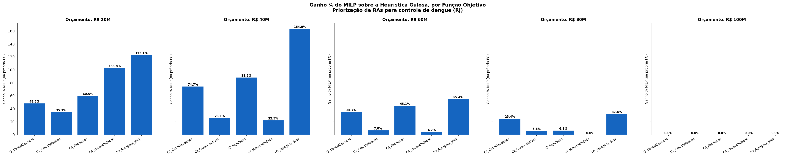

# Relatório: MILP vs. Heurística Gulosa, por Função Objetivo

Comparação justa: MILP e heurística otimizam/ordenam pela **mesma** função objetivo em cada teste.

## Orçamento: R$ 20M

| EC | FO | Método | RAs | Valor FO | Custo usado (R$M) | Uso (%) | Casos cobertos | Tempo (s) | Jaccard | Ganho % FO | Ganho % Casos |
|---|---|---|---:|---:|---:|---:|---:|---:|---:|---:|---:|
| EC1 | C1 — Casos Absolutos | **MILP** | 19 | 45125.0000 | 19.99 | 99.9 | 45125 | 0.0687 | 1.00 | +0.0% | +0.0% |
| — | C1 — Casos Absolutos | Heurística | 7 | 30379.0000 | 19.95 | 99.7 | 30379 | 0.0015 | 0.24 | +48.5% | +48.5% |
| EC2 | C2 — Casos Relativos (Incidência) | **MILP** | 22 | 0.3894 | 19.90 | 99.5 | 42714 | 0.0326 | 1.00 | +0.0% | +0.0% |
| — | C2 — Casos Relativos (Incidência) | Heurística | 12 | 0.2883 | 19.97 | 99.9 | 30900 | 0.0012 | 0.48 | +35.1% | +38.2% |
| EC3 | C3 — População | **MILP** | 22 | 2915283.0000 | 19.87 | 99.4 | 44828 | 0.0427 | 1.00 | +0.0% | +0.0% |
| — | C3 — População | Heurística | 5 | 1816642.0000 | 19.95 | 99.7 | 23358 | 0.0016 | 0.12 | +60.5% | +91.9% |
| EC4 | C4 — Vulnerabilidade (IPS) | **MILP** | 21 | 14.2430 | 19.85 | 99.2 | 41281 | 0.0400 | 1.00 | +0.0% | +0.0% |
| — | C4 — Vulnerabilidade (IPS) | Heurística | 8 | 7.0168 | 19.78 | 98.9 | 15974 | 0.0016 | 0.32 | +103.0% | +158.4% |
| EC5 | FO Agregada — SAW (pesos 0,25 cada) | **MILP** | 22 | 7.1549 | 19.93 | 99.6 | 43854 | 0.0411 | 1.00 | +0.0% | +0.0% |
| — | FO Agregada — SAW (pesos 0,25 cada) | Heurística | 7 | 3.2066 | 19.98 | 99.9 | 30027 | 0.0018 | 0.21 | +123.1% | +46.0% |

## Orçamento: R$ 40M

| EC | FO | Método | RAs | Valor FO | Custo usado (R$M) | Uso (%) | Casos cobertos | Tempo (s) | Jaccard | Ganho % FO | Ganho % Casos |
|---|---|---|---:|---:|---:|---:|---:|---:|---:|---:|---:|
| EC1 | C1 — Casos Absolutos | **MILP** | 26 | 67374.0000 | 39.72 | 99.3 | 67374 | 0.0469 | 1.00 | +0.0% | +0.0% |
| — | C1 — Casos Absolutos | Heurística | 6 | 38562.0000 | 39.94 | 99.8 | 38562 | 0.0016 | 0.14 | +74.7% | +74.7% |
| EC2 | C2 — Casos Relativos (Incidência) | **MILP** | 27 | 0.4555 | 36.36 | 90.9 | 60540 | 0.0369 | 1.00 | +0.0% | +0.0% |
| — | C2 — Casos Relativos (Incidência) | Heurística | 17 | 0.3613 | 39.92 | 99.8 | 41657 | 0.0013 | 0.52 | +26.1% | +45.3% |
| EC3 | C3 — População | **MILP** | 25 | 4236651.0000 | 39.95 | 99.9 | 61615 | 0.0382 | 1.00 | +0.0% | +0.0% |
| — | C3 — População | Heurística | 5 | 2247675.0000 | 39.99 | 100.0 | 36607 | 0.0013 | 0.11 | +88.5% | +68.3% |
| EC4 | C4 — Vulnerabilidade (IPS) | **MILP** | 24 | 16.4106 | 38.77 | 96.9 | 52577 | 0.0394 | 1.00 | +0.0% | +0.0% |
| — | C4 — Vulnerabilidade (IPS) | Heurística | 17 | 13.3945 | 39.85 | 99.6 | 41359 | 0.0013 | 0.64 | +22.5% | +27.1% |
| EC5 | FO Agregada — SAW (pesos 0,25 cada) | **MILP** | 26 | 8.9237 | 39.72 | 99.3 | 67374 | 0.0364 | 1.00 | +0.0% | +0.0% |
| — | FO Agregada — SAW (pesos 0,25 cada) | Heurística | 6 | 3.3807 | 39.94 | 99.8 | 38562 | 0.0017 | 0.14 | +164.0% | +74.7% |

## Orçamento: R$ 60M

| EC | FO | Método | RAs | Valor FO | Custo usado (R$M) | Uso (%) | Casos cobertos | Tempo (s) | Jaccard | Ganho % FO | Ganho % Casos |
|---|---|---|---:|---:|---:|---:|---:|---:|---:|---:|---:|
| EC1 | C1 — Casos Absolutos | **MILP** | 28 | 81459.0000 | 59.70 | 99.5 | 81459 | 0.0534 | 1.00 | +0.0% | +0.0% |
| — | C1 — Casos Absolutos | Heurística | 11 | 60033.0000 | 59.95 | 99.9 | 60033 | 0.0020 | 0.30 | +35.7% | +35.7% |
| EC2 | C2 — Casos Relativos (Incidência) | **MILP** | 29 | 0.4975 | 59.67 | 99.4 | 76882 | 0.0373 | 1.00 | +0.0% | +0.0% |
| — | C2 — Casos Relativos (Incidência) | Heurística | 24 | 0.4651 | 59.97 | 99.9 | 73161 | 0.0026 | 0.77 | +7.0% | +5.1% |
| EC3 | C3 — População | **MILP** | 29 | 5212291.0000 | 57.86 | 96.4 | 81242 | 0.0374 | 1.00 | +0.0% | +0.0% |
| — | C3 — População | Heurística | 9 | 3591402.0000 | 59.96 | 99.9 | 53850 | 0.0019 | 0.23 | +45.1% | +50.9% |
| EC4 | C4 — Vulnerabilidade (IPS) | **MILP** | 27 | 17.9480 | 58.59 | 97.7 | 68081 | 0.0334 | 1.00 | +0.0% | +0.0% |
| — | C4 — Vulnerabilidade (IPS) | Heurística | 24 | 17.1414 | 59.61 | 99.4 | 67157 | 0.0014 | 0.82 | +4.7% | +1.4% |
| EC5 | FO Agregada — SAW (pesos 0,25 cada) | **MILP** | 29 | 10.1697 | 57.86 | 96.4 | 81242 | 0.0317 | 1.00 | +0.0% | +0.0% |
| — | FO Agregada — SAW (pesos 0,25 cada) | Heurística | 14 | 6.5439 | 60.00 | 100.0 | 62927 | 0.0015 | 0.39 | +55.4% | +29.1% |

## Orçamento: R$ 80M

| EC | FO | Método | RAs | Valor FO | Custo usado (R$M) | Uso (%) | Casos cobertos | Tempo (s) | Jaccard | Ganho % FO | Ganho % Casos |
|---|---|---|---:|---:|---:|---:|---:|---:|---:|---:|---:|
| EC1 | C1 — Casos Absolutos | **MILP** | 30 | 91999.0000 | 79.63 | 99.5 | 91999 | 0.0528 | 1.00 | +0.0% | +0.0% |
| — | C1 — Casos Absolutos | Heurística | 17 | 73389.0000 | 79.94 | 99.9 | 73389 | 0.0017 | 0.52 | +25.4% | +25.4% |
| EC2 | C2 — Casos Relativos (Incidência) | **MILP** | 30 | 0.5188 | 72.79 | 91.0 | 85690 | 0.0431 | 1.00 | +0.0% | +0.0% |
| — | C2 — Casos Relativos (Incidência) | Heurística | 25 | 0.4866 | 79.98 | 100.0 | 88626 | 0.0021 | 0.77 | +6.6% | -3.3% |
| EC3 | C3 — População | **MILP** | 29 | 5824092.0000 | 79.93 | 99.9 | 91063 | 0.0476 | 1.00 | +0.0% | +0.0% |
| — | C3 — População | Heurística | 21 | 5454466.0000 | 79.96 | 99.9 | 83584 | 0.0020 | 0.67 | +6.8% | +8.9% |
| EC4 | C4 — Vulnerabilidade (IPS) | **MILP** | 28 | 19.0681 | 79.68 | 99.6 | 87212 | 0.0380 | 1.00 | +0.0% | +0.0% |
| — | C4 — Vulnerabilidade (IPS) | Heurística | 28 | 19.0681 | 79.68 | 99.6 | 87212 | 0.0015 | 1.00 | +0.0% | +0.0% |
| EC5 | FO Agregada — SAW (pesos 0,25 cada) | **MILP** | 30 | 11.0674 | 79.81 | 99.8 | 90891 | 0.0378 | 1.00 | +0.0% | +0.0% |
| — | FO Agregada — SAW (pesos 0,25 cada) | Heurística | 19 | 8.3365 | 79.77 | 99.7 | 75324 | 0.0021 | 0.58 | +32.8% | +20.7% |

## Orçamento: R$ 100M

| EC | FO | Método | RAs | Valor FO | Custo usado (R$M) | Uso (%) | Casos cobertos | Tempo (s) | Jaccard | Ganho % FO | Ganho % Casos |
|---|---|---|---:|---:|---:|---:|---:|---:|---:|---:|---:|
| EC1 | C1 — Casos Absolutos | **MILP** | 32 | 98620.0000 | 96.20 | 96.2 | 98620 | 0.0424 | 1.00 | +0.0% | +0.0% |
| — | C1 — Casos Absolutos | Heurística | 32 | 98620.0000 | 96.20 | 96.2 | 98620 | 0.0027 | 1.00 | +0.0% | +0.0% |
| EC2 | C2 — Casos Relativos (Incidência) | **MILP** | 32 | 0.5429 | 96.20 | 96.2 | 98620 | 0.0312 | 1.00 | +0.0% | +0.0% |
| — | C2 — Casos Relativos (Incidência) | Heurística | 32 | 0.5429 | 96.20 | 96.2 | 98620 | 0.0024 | 1.00 | +0.0% | +0.0% |
| EC3 | C3 — População | **MILP** | 32 | 6207737.0000 | 96.20 | 96.2 | 98620 | 0.0486 | 1.00 | +0.0% | +0.0% |
| — | C3 — População | Heurística | 32 | 6207737.0000 | 96.20 | 96.2 | 98620 | 0.0024 | 1.00 | +0.0% | +0.0% |
| EC4 | C4 — Vulnerabilidade (IPS) | **MILP** | 31 | 19.7311 | 94.99 | 95.0 | 95718 | 0.0267 | 1.00 | +0.0% | +0.0% |
| — | C4 — Vulnerabilidade (IPS) | Heurística | 32 | 19.7311 | 96.20 | 96.2 | 98620 | 0.0020 | 0.97 | +0.0% | -2.9% |
| EC5 | FO Agregada — SAW (pesos 0,25 cada) | **MILP** | 32 | 11.7418 | 96.20 | 96.2 | 98620 | 0.0275 | 1.00 | +0.0% | +0.0% |
| — | FO Agregada — SAW (pesos 0,25 cada) | Heurística | 32 | 11.7418 | 96.20 | 96.2 | 98620 | 0.0019 | 1.00 | +0.0% | +0.0% |

## Tabela simplificada: método, critério, FO valor, N_RAs, tempo

| Orçamento | EC | Método | Critério | FO valor | N_RAs | Tempo (s) |
|---|---|---|---|---:|---:|---:|
| R$ 20M | EC1 | **MILP** | C1 — Casos Absolutos | 45125.0000 | 19 | 0.0687 |
| R$ 20M | — | Heurística | C1 — Casos Absolutos | 30379.0000 | 7 | 0.0015 |
| R$ 20M | EC2 | **MILP** | C2 — Casos Relativos (Incidência) | 0.3894 | 22 | 0.0326 |
| R$ 20M | — | Heurística | C2 — Casos Relativos (Incidência) | 0.2883 | 12 | 0.0012 |
| R$ 20M | EC3 | **MILP** | C3 — População | 2915283.0000 | 22 | 0.0427 |
| R$ 20M | — | Heurística | C3 — População | 1816642.0000 | 5 | 0.0016 |
| R$ 20M | EC4 | **MILP** | C4 — Vulnerabilidade (IPS) | 14.2430 | 21 | 0.0400 |
| R$ 20M | — | Heurística | C4 — Vulnerabilidade (IPS) | 7.0168 | 8 | 0.0016 |
| R$ 20M | EC5 | **MILP** | FO Agregada — SAW (pesos 0,25 cada) | 7.1549 | 22 | 0.0411 |
| R$ 20M | — | Heurística | FO Agregada — SAW (pesos 0,25 cada) | 3.2066 | 7 | 0.0018 |
| R$ 40M | EC1 | **MILP** | C1 — Casos Absolutos | 67374.0000 | 26 | 0.0469 |
| R$ 40M | — | Heurística | C1 — Casos Absolutos | 38562.0000 | 6 | 0.0016 |
| R$ 40M | EC2 | **MILP** | C2 — Casos Relativos (Incidência) | 0.4555 | 27 | 0.0369 |
| R$ 40M | — | Heurística | C2 — Casos Relativos (Incidência) | 0.3613 | 17 | 0.0013 |
| R$ 40M | EC3 | **MILP** | C3 — População | 4236651.0000 | 25 | 0.0382 |
| R$ 40M | — | Heurística | C3 — População | 2247675.0000 | 5 | 0.0013 |
| R$ 40M | EC4 | **MILP** | C4 — Vulnerabilidade (IPS) | 16.4106 | 24 | 0.0394 |
| R$ 40M | — | Heurística | C4 — Vulnerabilidade (IPS) | 13.3945 | 17 | 0.0013 |
| R$ 40M | EC5 | **MILP** | FO Agregada — SAW (pesos 0,25 cada) | 8.9237 | 26 | 0.0364 |
| R$ 40M | — | Heurística | FO Agregada — SAW (pesos 0,25 cada) | 3.3807 | 6 | 0.0017 |
| R$ 60M | EC1 | **MILP** | C1 — Casos Absolutos | 81459.0000 | 28 | 0.0534 |
| R$ 60M | — | Heurística | C1 — Casos Absolutos | 60033.0000 | 11 | 0.0020 |
| R$ 60M | EC2 | **MILP** | C2 — Casos Relativos (Incidência) | 0.4975 | 29 | 0.0373 |
| R$ 60M | — | Heurística | C2 — Casos Relativos (Incidência) | 0.4651 | 24 | 0.0026 |
| R$ 60M | EC3 | **MILP** | C3 — População | 5212291.0000 | 29 | 0.0374 |
| R$ 60M | — | Heurística | C3 — População | 3591402.0000 | 9 | 0.0019 |
| R$ 60M | EC4 | **MILP** | C4 — Vulnerabilidade (IPS) | 17.9480 | 27 | 0.0334 |
| R$ 60M | — | Heurística | C4 — Vulnerabilidade (IPS) | 17.1414 | 24 | 0.0014 |
| R$ 60M | EC5 | **MILP** | FO Agregada — SAW (pesos 0,25 cada) | 10.1697 | 29 | 0.0317 |
| R$ 60M | — | Heurística | FO Agregada — SAW (pesos 0,25 cada) | 6.5439 | 14 | 0.0015 |
| R$ 80M | EC1 | **MILP** | C1 — Casos Absolutos | 91999.0000 | 30 | 0.0528 |
| R$ 80M | — | Heurística | C1 — Casos Absolutos | 73389.0000 | 17 | 0.0017 |
| R$ 80M | EC2 | **MILP** | C2 — Casos Relativos (Incidência) | 0.5188 | 30 | 0.0431 |
| R$ 80M | — | Heurística | C2 — Casos Relativos (Incidência) | 0.4866 | 25 | 0.0021 |
| R$ 80M | EC3 | **MILP** | C3 — População | 5824092.0000 | 29 | 0.0476 |
| R$ 80M | — | Heurística | C3 — População | 5454466.0000 | 21 | 0.0020 |
| R$ 80M | EC4 | **MILP** | C4 — Vulnerabilidade (IPS) | 19.0681 | 28 | 0.0380 |
| R$ 80M | — | Heurística | C4 — Vulnerabilidade (IPS) | 19.0681 | 28 | 0.0015 |
| R$ 80M | EC5 | **MILP** | FO Agregada — SAW (pesos 0,25 cada) | 11.0674 | 30 | 0.0378 |
| R$ 80M | — | Heurística | FO Agregada — SAW (pesos 0,25 cada) | 8.3365 | 19 | 0.0021 |
| R$ 100M | EC1 | **MILP** | C1 — Casos Absolutos | 98620.0000 | 32 | 0.0424 |
| R$ 100M | — | Heurística | C1 — Casos Absolutos | 98620.0000 | 32 | 0.0027 |
| R$ 100M | EC2 | **MILP** | C2 — Casos Relativos (Incidência) | 0.5429 | 32 | 0.0312 |
| R$ 100M | — | Heurística | C2 — Casos Relativos (Incidência) | 0.5429 | 32 | 0.0024 |
| R$ 100M | EC3 | **MILP** | C3 — População | 6207737.0000 | 32 | 0.0486 |
| R$ 100M | — | Heurística | C3 — População | 6207737.0000 | 32 | 0.0024 |
| R$ 100M | EC4 | **MILP** | C4 — Vulnerabilidade (IPS) | 19.7311 | 31 | 0.0267 |
| R$ 100M | — | Heurística | C4 — Vulnerabilidade (IPS) | 19.7311 | 32 | 0.0020 |
| R$ 100M | EC5 | **MILP** | FO Agregada — SAW (pesos 0,25 cada) | 11.7418 | 32 | 0.0275 |
| R$ 100M | — | Heurística | FO Agregada — SAW (pesos 0,25 cada) | 11.7418 | 32 | 0.0019 |

## Resumo: tempo computacional médio (segundos)

| EC | FO | MILP (s) | Heurística (s) | MILP é quantas vezes mais lento? |
|---|---|---:|---:|---:|
| EC1 | C1 — Casos Absolutos | 0.0529 | 0.0019 | 28x |
| EC2 | C2 — Casos Relativos (Incidência) | 0.0362 | 0.0019 | 19x |
| EC3 | C3 — População | 0.0429 | 0.0018 | 23x |
| EC4 | C4 — Vulnerabilidade (IPS) | 0.0355 | 0.0016 | 23x |
| EC5 | FO Agregada — SAW (pesos 0,25 cada) | 0.0349 | 0.0018 | 19x |

## Tempo total das 4 heurísticas (C1+C2+C3+C4), por orçamento

| Orçamento | Tempo total (s) |
|---|---:|
| R$ 20M | 0.0060 |
| R$ 40M | 0.0055 |
| R$ 60M | 0.0080 |
| R$ 80M | 0.0073 |
| R$ 100M | 0.0095 |

## RAs atendidas por cenário

Cada célula mostra as RAs selecionadas (nomes) para aquele Estudo de Caso / heurística, no respectivo orçamento.

### Orçamento: R$ 20M

| EC/Método | FO | RAs atendidas |
|---|---|---|
| EC1 | C1 — Casos Absolutos | Anchieta, Botafogo, Cidade De Deus, Complexo do Alemão, Copacabana, Ilha Do Governador, Inhaúma, Irajá, Madureira, Méier, Pavuna, Penha, Portuária, Ramos, Rio Comprido, Rocinha, Santa Teresa, São Cristóvão, Vila Isabel |
| Heurística | C1 — Casos Absolutos | Bangu, Campo Grande, Cidade De Deus, Complexo do Alemão, Méier, Penha, Rocinha |
| EC2 | C2 — Casos Relativos (Incidência) | Anchieta, Botafogo, Centro, Cidade De Deus, Complexo do Alemão, Copacabana, Ilha Do Governador, Inhaúma, Irajá, Jacarezinho, Lagoa, Madureira, Maré, Penha, Portuária, Ramos, Rio Comprido, Rocinha, Santa Teresa, São Cristóvão, Vigário Geral, Vila Isabel |
| Heurística | C2 — Casos Relativos (Incidência) | Centro, Complexo do Alemão, Inhaúma, Penha, Portuária, Ramos, Rio Comprido, Rocinha, Santa Cruz, Santa Teresa, São Cristóvão, Vila Isabel |
| EC3 | C3 — População | Anchieta, Botafogo, Cidade De Deus, Complexo do Alemão, Copacabana, Inhaúma, Irajá, Jacarezinho, Lagoa, Madureira, Maré, Méier, Pavuna, Penha, Portuária, Ramos, Rio Comprido, Rocinha, Santa Teresa, São Cristóvão, Vigário Geral, Vila Isabel |
| Heurística | C3 — População | Bangu, Botafogo, Jacarepaguá, Méier, Vila Isabel |
| EC4 | C4 — Vulnerabilidade (IPS) | Anchieta, Bangu, Centro, Cidade De Deus, Complexo do Alemão, Copacabana, Inhaúma, Irajá, Jacarezinho, Madureira, Maré, Pavuna, Penha, Portuária, Ramos, Rio Comprido, Rocinha, Santa Teresa, São Cristóvão, Vigário Geral, Vila Isabel |
| Heurística | C4 — Vulnerabilidade (IPS) | Bangu, Cidade De Deus, Complexo do Alemão, Guaratiba, Jacarezinho, Pavuna, Portuária, Rocinha |
| EC5 | FO Agregada — SAW (pesos 0,25 cada) | Anchieta, Botafogo, Centro, Cidade De Deus, Complexo do Alemão, Inhaúma, Irajá, Jacarezinho, Lagoa, Madureira, Maré, Méier, Pavuna, Penha, Portuária, Ramos, Rio Comprido, Rocinha, Santa Teresa, São Cristóvão, Vigário Geral, Vila Isabel |
| Heurística | FO Agregada — SAW (pesos 0,25 cada) | Bangu, Campo Grande, Complexo do Alemão, Jacarezinho, Madureira, Penha, Rocinha |

### Orçamento: R$ 40M

| EC/Método | FO | RAs atendidas |
|---|---|---|
| EC1 | C1 — Casos Absolutos | Anchieta, Bangu, Botafogo, Campo Grande, Centro, Cidade De Deus, Complexo do Alemão, Copacabana, Ilha Do Governador, Inhaúma, Irajá, Jacarezinho, Lagoa, Madureira, Maré, Méier, Pavuna, Penha, Portuária, Ramos, Rio Comprido, Rocinha, Santa Teresa, São Cristóvão, Vigário Geral, Vila Isabel |
| Heurística | C1 — Casos Absolutos | Bangu, Campo Grande, Complexo do Alemão, Jacarepaguá, Rocinha, Santa Cruz |
| EC2 | C2 — Casos Relativos (Incidência) | Anchieta, Bangu, Botafogo, Centro, Cidade De Deus, Complexo do Alemão, Copacabana, Ilha Do Governador, Inhaúma, Irajá, Jacarezinho, Lagoa, Madureira, Maré, Méier, Pavuna, Penha, Portuária, Ramos, Realengo, Rio Comprido, Rocinha, Santa Teresa, São Cristóvão, Tijuca, Vigário Geral, Vila Isabel |
| Heurística | C2 — Casos Relativos (Incidência) | Centro, Cidade De Deus, Complexo do Alemão, Guaratiba, Ilha Do Governador, Inhaúma, Jacarezinho, Lagoa, Penha, Portuária, Ramos, Rio Comprido, Rocinha, Santa Cruz, Santa Teresa, São Cristóvão, Tijuca |
| EC3 | C3 — População | Anchieta, Bangu, Botafogo, Centro, Complexo do Alemão, Copacabana, Inhaúma, Irajá, Jacarepaguá, Jacarezinho, Lagoa, Madureira, Maré, Méier, Pavuna, Penha, Portuária, Ramos, Realengo, Rio Comprido, Rocinha, Santa Teresa, São Cristóvão, Vigário Geral, Vila Isabel |
| Heurística | C3 — População | Bangu, Campo Grande, Copacabana, Jacarepaguá, Santa Cruz |
| EC4 | C4 — Vulnerabilidade (IPS) | Anchieta, Bangu, Centro, Cidade De Deus, Complexo do Alemão, Copacabana, Guaratiba, Inhaúma, Irajá, Jacarezinho, Madureira, Maré, Méier, Pavuna, Penha, Portuária, Ramos, Realengo, Rio Comprido, Rocinha, Santa Teresa, São Cristóvão, Vigário Geral, Vila Isabel |
| Heurística | C4 — Vulnerabilidade (IPS) | Bangu, Centro, Cidade De Deus, Complexo do Alemão, Guaratiba, Inhaúma, Jacarezinho, Madureira, Maré, Pavuna, Portuária, Ramos, Rio Comprido, Rocinha, Santa Cruz, São Cristóvão, Vigário Geral |
| EC5 | FO Agregada — SAW (pesos 0,25 cada) | Anchieta, Bangu, Botafogo, Campo Grande, Centro, Cidade De Deus, Complexo do Alemão, Copacabana, Ilha Do Governador, Inhaúma, Irajá, Jacarezinho, Lagoa, Madureira, Maré, Méier, Pavuna, Penha, Portuária, Ramos, Rio Comprido, Rocinha, Santa Teresa, São Cristóvão, Vigário Geral, Vila Isabel |
| Heurística | FO Agregada — SAW (pesos 0,25 cada) | Bangu, Campo Grande, Complexo do Alemão, Jacarepaguá, Rocinha, Santa Cruz |

### Orçamento: R$ 60M

| EC/Método | FO | RAs atendidas |
|---|---|---|
| EC1 | C1 — Casos Absolutos | Anchieta, Bangu, Botafogo, Campo Grande, Centro, Cidade De Deus, Complexo do Alemão, Copacabana, Ilha Do Governador, Inhaúma, Irajá, Jacarezinho, Lagoa, Madureira, Maré, Méier, Pavuna, Penha, Portuária, Ramos, Realengo, Rio Comprido, Rocinha, Santa Cruz, Santa Teresa, São Cristóvão, Tijuca, Vila Isabel |
| Heurística | C1 — Casos Absolutos | Bangu, Barra Da Tijuca, Campo Grande, Complexo do Alemão, Copacabana, Inhaúma, Jacarepaguá, Madureira, Méier, Penha, Santa Cruz |
| EC2 | C2 — Casos Relativos (Incidência) | Anchieta, Bangu, Botafogo, Campo Grande, Centro, Cidade De Deus, Complexo do Alemão, Copacabana, Guaratiba, Ilha Do Governador, Inhaúma, Irajá, Jacarezinho, Lagoa, Madureira, Maré, Méier, Pavuna, Penha, Portuária, Ramos, Realengo, Rio Comprido, Rocinha, Santa Teresa, São Cristóvão, Tijuca, Vigário Geral, Vila Isabel |
| Heurística | C2 — Casos Relativos (Incidência) | Botafogo, Campo Grande, Centro, Cidade De Deus, Complexo do Alemão, Copacabana, Guaratiba, Ilha Do Governador, Inhaúma, Irajá, Lagoa, Madureira, Maré, Méier, Penha, Portuária, Ramos, Rio Comprido, Rocinha, Santa Cruz, Santa Teresa, São Cristóvão, Tijuca, Vila Isabel |
| EC3 | C3 — População | Anchieta, Bangu, Botafogo, Campo Grande, Centro, Cidade De Deus, Complexo do Alemão, Copacabana, Ilha Do Governador, Inhaúma, Irajá, Jacarepaguá, Jacarezinho, Lagoa, Madureira, Maré, Méier, Pavuna, Penha, Portuária, Ramos, Realengo, Rio Comprido, Rocinha, Santa Teresa, São Cristóvão, Tijuca, Vigário Geral, Vila Isabel |
| Heurística | C3 — População | Bangu, Barra Da Tijuca, Botafogo, Campo Grande, Jacarepaguá, Madureira, Méier, Pavuna, Santa Cruz |
| EC4 | C4 — Vulnerabilidade (IPS) | Anchieta, Bangu, Centro, Cidade De Deus, Complexo do Alemão, Copacabana, Guaratiba, Ilha Do Governador, Inhaúma, Irajá, Jacarezinho, Madureira, Maré, Méier, Pavuna, Penha, Portuária, Ramos, Realengo, Rio Comprido, Rocinha, Santa Cruz, Santa Teresa, São Cristóvão, Tijuca, Vigário Geral, Vila Isabel |
| Heurística | C4 — Vulnerabilidade (IPS) | Anchieta, Bangu, Campo Grande, Centro, Cidade De Deus, Complexo do Alemão, Copacabana, Guaratiba, Inhaúma, Irajá, Jacarezinho, Madureira, Maré, Pavuna, Penha, Portuária, Ramos, Realengo, Rio Comprido, Rocinha, Santa Cruz, Santa Teresa, São Cristóvão, Vigário Geral |
| EC5 | FO Agregada — SAW (pesos 0,25 cada) | Anchieta, Bangu, Botafogo, Campo Grande, Centro, Cidade De Deus, Complexo do Alemão, Copacabana, Ilha Do Governador, Inhaúma, Irajá, Jacarepaguá, Jacarezinho, Lagoa, Madureira, Maré, Méier, Pavuna, Penha, Portuária, Ramos, Realengo, Rio Comprido, Rocinha, Santa Teresa, São Cristóvão, Tijuca, Vigário Geral, Vila Isabel |
| Heurística | FO Agregada — SAW (pesos 0,25 cada) | Bangu, Campo Grande, Complexo do Alemão, Guaratiba, Inhaúma, Jacarepaguá, Jacarezinho, Madureira, Méier, Penha, Rio Comprido, Rocinha, Santa Cruz, São Cristóvão |

### Orçamento: R$ 80M

| EC/Método | FO | RAs atendidas |
|---|---|---|
| EC1 | C1 — Casos Absolutos | Anchieta, Bangu, Barra Da Tijuca, Botafogo, Campo Grande, Centro, Cidade De Deus, Complexo do Alemão, Copacabana, Ilha Do Governador, Inhaúma, Irajá, Jacarepaguá, Jacarezinho, Lagoa, Madureira, Maré, Méier, Pavuna, Penha, Portuária, Ramos, Rio Comprido, Rocinha, Santa Cruz, Santa Teresa, São Cristóvão, Tijuca, Vigário Geral, Vila Isabel |
| Heurística | C1 — Casos Absolutos | Bangu, Barra Da Tijuca, Botafogo, Campo Grande, Cidade De Deus, Complexo do Alemão, Guaratiba, Ilha Do Governador, Inhaúma, Jacarepaguá, Jacarezinho, Madureira, Méier, Penha, Rocinha, Santa Cruz, Tijuca |
| EC2 | C2 — Casos Relativos (Incidência) | Anchieta, Bangu, Botafogo, Campo Grande, Centro, Cidade De Deus, Complexo do Alemão, Copacabana, Guaratiba, Ilha Do Governador, Inhaúma, Irajá, Jacarezinho, Lagoa, Madureira, Maré, Méier, Pavuna, Penha, Portuária, Ramos, Realengo, Rio Comprido, Rocinha, Santa Cruz, Santa Teresa, São Cristóvão, Tijuca, Vigário Geral, Vila Isabel |
| Heurística | C2 — Casos Relativos (Incidência) | Anchieta, Bangu, Botafogo, Campo Grande, Centro, Complexo do Alemão, Guaratiba, Ilha Do Governador, Inhaúma, Irajá, Jacarepaguá, Lagoa, Madureira, Méier, Penha, Portuária, Ramos, Realengo, Rio Comprido, Rocinha, Santa Cruz, Santa Teresa, São Cristóvão, Tijuca, Vila Isabel |
| EC3 | C3 — População | Anchieta, Bangu, Barra Da Tijuca, Botafogo, Campo Grande, Centro, Cidade De Deus, Complexo do Alemão, Copacabana, Ilha Do Governador, Inhaúma, Irajá, Jacarepaguá, Jacarezinho, Lagoa, Madureira, Maré, Méier, Pavuna, Penha, Ramos, Realengo, Rio Comprido, Rocinha, Santa Cruz, Santa Teresa, São Cristóvão, Vigário Geral, Vila Isabel |
| Heurística | C3 — População | Anchieta, Bangu, Barra Da Tijuca, Botafogo, Campo Grande, Copacabana, Ilha Do Governador, Inhaúma, Irajá, Jacarepaguá, Lagoa, Madureira, Maré, Méier, Pavuna, Penha, Ramos, Realengo, Santa Cruz, Tijuca, Vila Isabel |
| EC4 | C4 — Vulnerabilidade (IPS) | Anchieta, Bangu, Campo Grande, Centro, Cidade De Deus, Complexo do Alemão, Guaratiba, Ilha Do Governador, Inhaúma, Irajá, Jacarepaguá, Jacarezinho, Madureira, Maré, Méier, Pavuna, Penha, Portuária, Ramos, Realengo, Rio Comprido, Rocinha, Santa Cruz, Santa Teresa, São Cristóvão, Tijuca, Vigário Geral, Vila Isabel |
| Heurística | C4 — Vulnerabilidade (IPS) | Anchieta, Bangu, Campo Grande, Centro, Cidade De Deus, Complexo do Alemão, Guaratiba, Ilha Do Governador, Inhaúma, Irajá, Jacarepaguá, Jacarezinho, Madureira, Maré, Méier, Pavuna, Penha, Portuária, Ramos, Realengo, Rio Comprido, Rocinha, Santa Cruz, Santa Teresa, São Cristóvão, Tijuca, Vigário Geral, Vila Isabel |
| EC5 | FO Agregada — SAW (pesos 0,25 cada) | Anchieta, Bangu, Botafogo, Campo Grande, Centro, Cidade De Deus, Complexo do Alemão, Copacabana, Guaratiba, Ilha Do Governador, Inhaúma, Irajá, Jacarepaguá, Jacarezinho, Lagoa, Madureira, Maré, Méier, Pavuna, Penha, Portuária, Ramos, Realengo, Rio Comprido, Rocinha, Santa Cruz, Santa Teresa, São Cristóvão, Vigário Geral, Vila Isabel |
| Heurística | FO Agregada — SAW (pesos 0,25 cada) | Bangu, Barra Da Tijuca, Campo Grande, Cidade De Deus, Complexo do Alemão, Guaratiba, Inhaúma, Jacarepaguá, Jacarezinho, Madureira, Méier, Pavuna, Penha, Ramos, Realengo, Rio Comprido, Rocinha, Santa Cruz, São Cristóvão |

### Orçamento: R$ 100M

| EC/Método | FO | RAs atendidas |
|---|---|---|
| EC1 | C1 — Casos Absolutos | Anchieta, Bangu, Barra Da Tijuca, Botafogo, Campo Grande, Centro, Cidade De Deus, Complexo do Alemão, Copacabana, Guaratiba, Ilha Do Governador, Inhaúma, Irajá, Jacarepaguá, Jacarezinho, Lagoa, Madureira, Maré, Méier, Pavuna, Penha, Portuária, Ramos, Realengo, Rio Comprido, Rocinha, Santa Cruz, Santa Teresa, São Cristóvão, Tijuca, Vigário Geral, Vila Isabel |
| Heurística | C1 — Casos Absolutos | Anchieta, Bangu, Barra Da Tijuca, Botafogo, Campo Grande, Centro, Cidade De Deus, Complexo do Alemão, Copacabana, Guaratiba, Ilha Do Governador, Inhaúma, Irajá, Jacarepaguá, Jacarezinho, Lagoa, Madureira, Maré, Méier, Pavuna, Penha, Portuária, Ramos, Realengo, Rio Comprido, Rocinha, Santa Cruz, Santa Teresa, São Cristóvão, Tijuca, Vigário Geral, Vila Isabel |
| EC2 | C2 — Casos Relativos (Incidência) | Anchieta, Bangu, Barra Da Tijuca, Botafogo, Campo Grande, Centro, Cidade De Deus, Complexo do Alemão, Copacabana, Guaratiba, Ilha Do Governador, Inhaúma, Irajá, Jacarepaguá, Jacarezinho, Lagoa, Madureira, Maré, Méier, Pavuna, Penha, Portuária, Ramos, Realengo, Rio Comprido, Rocinha, Santa Cruz, Santa Teresa, São Cristóvão, Tijuca, Vigário Geral, Vila Isabel |
| Heurística | C2 — Casos Relativos (Incidência) | Anchieta, Bangu, Barra Da Tijuca, Botafogo, Campo Grande, Centro, Cidade De Deus, Complexo do Alemão, Copacabana, Guaratiba, Ilha Do Governador, Inhaúma, Irajá, Jacarepaguá, Jacarezinho, Lagoa, Madureira, Maré, Méier, Pavuna, Penha, Portuária, Ramos, Realengo, Rio Comprido, Rocinha, Santa Cruz, Santa Teresa, São Cristóvão, Tijuca, Vigário Geral, Vila Isabel |
| EC3 | C3 — População | Anchieta, Bangu, Barra Da Tijuca, Botafogo, Campo Grande, Centro, Cidade De Deus, Complexo do Alemão, Copacabana, Guaratiba, Ilha Do Governador, Inhaúma, Irajá, Jacarepaguá, Jacarezinho, Lagoa, Madureira, Maré, Méier, Pavuna, Penha, Portuária, Ramos, Realengo, Rio Comprido, Rocinha, Santa Cruz, Santa Teresa, São Cristóvão, Tijuca, Vigário Geral, Vila Isabel |
| Heurística | C3 — População | Anchieta, Bangu, Barra Da Tijuca, Botafogo, Campo Grande, Centro, Cidade De Deus, Complexo do Alemão, Copacabana, Guaratiba, Ilha Do Governador, Inhaúma, Irajá, Jacarepaguá, Jacarezinho, Lagoa, Madureira, Maré, Méier, Pavuna, Penha, Portuária, Ramos, Realengo, Rio Comprido, Rocinha, Santa Cruz, Santa Teresa, São Cristóvão, Tijuca, Vigário Geral, Vila Isabel |
| EC4 | C4 — Vulnerabilidade (IPS) | Anchieta, Bangu, Barra Da Tijuca, Campo Grande, Centro, Cidade De Deus, Complexo do Alemão, Copacabana, Guaratiba, Ilha Do Governador, Inhaúma, Irajá, Jacarepaguá, Jacarezinho, Lagoa, Madureira, Maré, Méier, Pavuna, Penha, Portuária, Ramos, Realengo, Rio Comprido, Rocinha, Santa Cruz, Santa Teresa, São Cristóvão, Tijuca, Vigário Geral, Vila Isabel |
| Heurística | C4 — Vulnerabilidade (IPS) | Anchieta, Bangu, Barra Da Tijuca, Botafogo, Campo Grande, Centro, Cidade De Deus, Complexo do Alemão, Copacabana, Guaratiba, Ilha Do Governador, Inhaúma, Irajá, Jacarepaguá, Jacarezinho, Lagoa, Madureira, Maré, Méier, Pavuna, Penha, Portuária, Ramos, Realengo, Rio Comprido, Rocinha, Santa Cruz, Santa Teresa, São Cristóvão, Tijuca, Vigário Geral, Vila Isabel |
| EC5 | FO Agregada — SAW (pesos 0,25 cada) | Anchieta, Bangu, Barra Da Tijuca, Botafogo, Campo Grande, Centro, Cidade De Deus, Complexo do Alemão, Copacabana, Guaratiba, Ilha Do Governador, Inhaúma, Irajá, Jacarepaguá, Jacarezinho, Lagoa, Madureira, Maré, Méier, Pavuna, Penha, Portuária, Ramos, Realengo, Rio Comprido, Rocinha, Santa Cruz, Santa Teresa, São Cristóvão, Tijuca, Vigário Geral, Vila Isabel |
| Heurística | FO Agregada — SAW (pesos 0,25 cada) | Anchieta, Bangu, Barra Da Tijuca, Botafogo, Campo Grande, Centro, Cidade De Deus, Complexo do Alemão, Copacabana, Guaratiba, Ilha Do Governador, Inhaúma, Irajá, Jacarepaguá, Jacarezinho, Lagoa, Madureira, Maré, Méier, Pavuna, Penha, Portuária, Ramos, Realengo, Rio Comprido, Rocinha, Santa Cruz, Santa Teresa, São Cristóvão, Tijuca, Vigário Geral, Vila Isabel |

## Arquivos gerados

- Tabela completa (CSV): `tabela_milp_vs_heuristica_por_fo.csv`
- Tabela simplificada (método/critério/FO/RAs/tempo): `tabela_metodo_criterio_tempo.csv`
- RAs atendidas (matriz, Excel): `ras_atendidas_matriz.xlsx`
- Resumo de tempo (CSV): `tempo_computacional_resumo.csv`
- Gráfico: `ganho_milp_por_fo.png`

