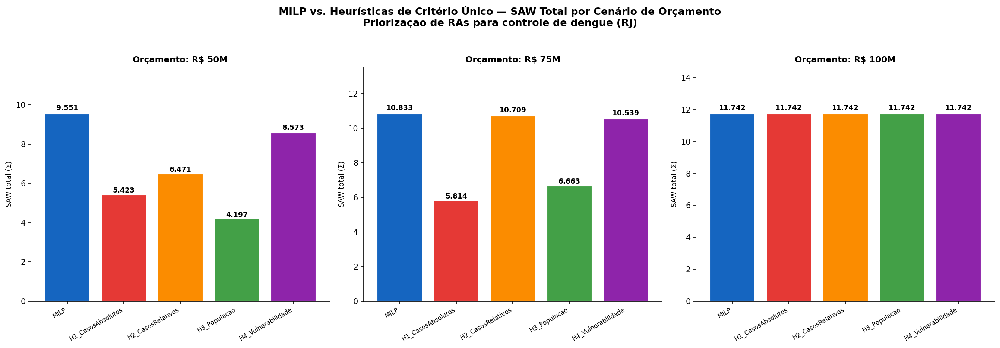

# Comparação MILP vs. Heurísticas — Priorização de Dengue (RJ)

**RAs carregadas:** 32  
**Custo total para cobrir todas as RAs (B_full):** R$ 96,195,624

## Orçamento: R$ 50M

| Método | RAs | SAW total | Custo usado (R$M) | Jaccard vs. MILP | Ganho % MILP (SAW) | Ganho % MILP (casos) |
|---|---:|---:|---:|---:|---:|---:|
| **MILP** | 28 | 9.5509 | 47.46 | 1.00 | +0.0% | +0.0% |
| H1_CasosAbsolutos | 11 | 5.4231 | 49.97 | 0.30 | +76.1% | +24.8% |
| H2_CasosRelativos | 16 | 6.4713 | 49.98 | 0.47 | +47.6% | +35.6% |
| H3_Populacao | 9 | 4.1966 | 50.00 | 0.23 | +127.6% | +45.9% |
| H4_Vulnerabilidade | 24 | 8.5732 | 49.54 | 0.73 | +11.4% | +29.0% |

## Orçamento: R$ 75M

| Método | RAs | SAW total | Custo usado (R$M) | Jaccard vs. MILP | Ganho % MILP (SAW) | Ganho % MILP (casos) |
|---|---:|---:|---:|---:|---:|---:|
| **MILP** | 30 | 10.8329 | 70.98 | 1.00 | +0.0% | +0.0% |
| H1_CasosAbsolutos | 12 | 5.8137 | 74.94 | 0.31 | +86.3% | +38.8% |
| H2_CasosRelativos | 30 | 10.7085 | 72.79 | 0.94 | +1.2% | +5.1% |
| H3_Populacao | 17 | 6.6631 | 74.98 | 0.52 | +62.6% | +24.5% |
| H4_Vulnerabilidade | 28 | 10.5392 | 74.59 | 0.87 | +2.8% | +6.0% |

## Orçamento: R$ 100M

| Método | RAs | SAW total | Custo usado (R$M) | Jaccard vs. MILP | Ganho % MILP (SAW) | Ganho % MILP (casos) |
|---|---:|---:|---:|---:|---:|---:|
| **MILP** | 32 | 11.7418 | 96.20 | 1.00 | +0.0% | +0.0% |
| H1_CasosAbsolutos | 32 | 11.7418 | 96.20 | 1.00 | +0.0% | +0.0% |
| H2_CasosRelativos | 32 | 11.7418 | 96.20 | 1.00 | +0.0% | +0.0% |
| H3_Populacao | 32 | 11.7418 | 96.20 | 1.00 | +0.0% | +0.0% |
| H4_Vulnerabilidade | 32 | 11.7418 | 96.20 | 1.00 | +0.0% | +0.0% |

## Arquivos gerados

- Gráfico: `milp_vs_heuristicas_dengue.png`
- Tabela completa (CSV): `tabela_milp_vs_heuristicas.csv`

